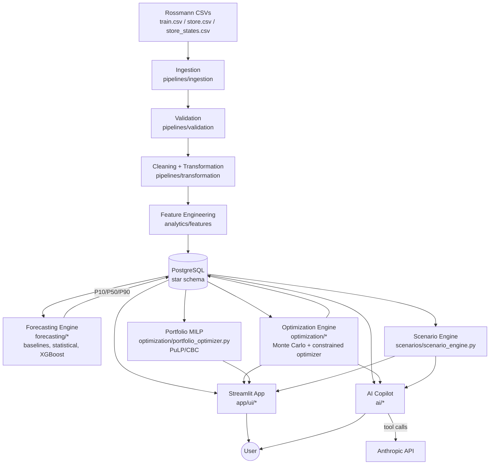
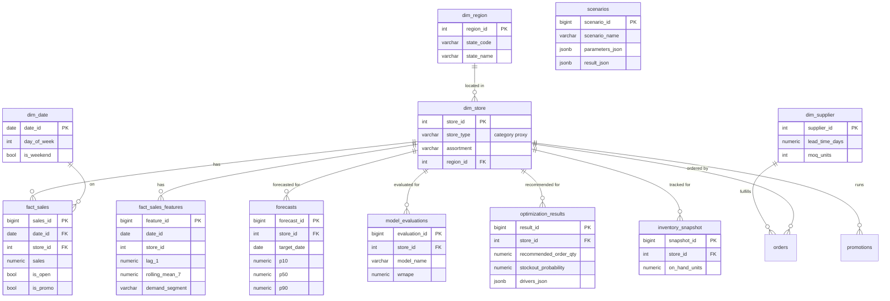

# SupplySense — Intelligent Demand Forecasting & Inventory Decision Engine

SupplySense turns raw retail sales history into inventory **decisions**:
what to order, how much safety stock to hold, and what the stockout /
cost tradeoffs look like under different assumptions. It was built in
five phases and is now feature-complete end-to-end (Phases 1-5).

```
Raw Data → Ingestion → Validation → Cleaning → Transformation →
Feature Engineering → PostgreSQL → Forecasting → Optimization →
Simulation → Scenario Analysis → AI Copilot
```

---

## Quick Start (full setup, all phases)

```bash
# 1. PostgreSQL (native or Docker)
docker-compose up -d postgres
# -- or natively: create a 'supplysense' DB + user (see Phase 1 section below)

# 2. Python environment
python -m venv venv && source venv/bin/activate
pip install -r requirements.txt

# 3. Configure
cp .env.example .env
# Edit .env: DB credentials, and ANTHROPIC_API_KEY if you want the AI Copilot

# 4. Get the data
bash scripts/download_data.sh

# 5. Run everything (Phases 1-3: data, forecasting, optimization) + tests
bash scripts/run_all_pipelines.sh

# 6. Launch the app
streamlit run app/ui/Home.py
```
`scripts/run_all_pipelines.sh` runs the complete sequence (schema init → Phase 1 → Phase 2 benchmark → Phase 2 full-scale forecasting in 8 batches → Phase 3 → test suite) in one command; see the phase-by-phase sections below if you'd rather run/understand each step individually. Total runtime is roughly 10-20 minutes, dominated by generating 42-day forecasts for all 1,115 stores.

### Troubleshooting

- **`psql: error: connection to server on socket ... failed`**: your Postgres isn't reachable via the default local socket -- usually because it's running in Docker (`docker-compose up -d postgres`). Connect over TCP instead: `psql -h localhost -p 5432 -U supplysense -d supplysense`.
- **`psql: FATAL: password authentication failed`** even with the right password: don't fight `psql` credentials manually -- use `python -m scripts.create_readonly_role` instead (see Phase 5), which reuses the same DB connection your already-working app/tests use from `.env`. If that then fails with `permission denied to create role`, your DB user lacks `CREATEROLE`; see the Phase 5 read-only-role section for the fix.
- **`186 passed, 5 skipped` instead of `199 passed, 1 skipped`**: the 4 extra skips are `tests/test_readonly_role.py` auto-skipping because you haven't run `database/create_readonly_role.sql` yet -- this is expected, not a bug; run that script (see Phase 5) to enable those tests.
- **AI Copilot page says no API key configured**: set `ANTHROPIC_API_KEY` or `GEMINI_API_KEY` in `.env` (see Phase 4/5 AI Copilot sections for provider details).

### Sample workflow (the platform's intended end-to-end use)

1. Open the app (`streamlit run app/ui/Home.py`) → **Home** shows portfolio-wide KPIs and exception alerts (which stores are high-risk or budget-constrained right now).
2. Go to **Forecast Explorer**, pick a store → see its historical demand, weekly seasonality, and P10/P50/P90 forecast.
3. Go to **Inventory Recommendations** for the same store → see the live-computed recommended order quantity, full cost breakdown, and plain-language decision drivers.
4. Go to **Scenario Simulator** → apply "Demand +20%" → compare the new recommendation to baseline side-by-side.
5. Go to **Optimization** → select a region → run the portfolio allocator to see how a shared budget should be split across that region's stores.
6. Go to **AI Copilot** → ask *"Why did store 710's recommended order increase?"* → the copilot calls the same live engines and cites the real decision drivers back to you.

### Architecture



### Database schema (star schema)



`dim_product` exists in the schema for architectural completeness but is intentionally unpopulated -- see the Phase 1 section for why.

---

## Phase 1 — Data Foundation (complete)

### Dataset

**Rossmann Store Sales** — a public retail dataset covering daily sales
for 1,115 drugstores in Germany from 2013-01-01 to 2015-07-31
(~1.02M store-day records). Retrieved from public GitHub mirrors of the
original Kaggle competition data:

- `train.csv` — daily `Sales`, `Customers`, `Open`, `Promo`,
  `StateHoliday`, `SchoolHoliday` per store
- `store.csv` — `StoreType`, `Assortment`, `CompetitionDistance`,
  `Promo2` fields per store
- `store_states.csv` — store → German federal state mapping

Run `scripts/download_data.sh` to (re)fetch these into `data/raw/`.

### Documented proxy decisions

This is real sales data, not a synthetic supply-chain dataset, so a few
fields required documented, defensible proxies rather than fabrication:

| Business concept | Real field used | Notes |
|---|---|---|
| Category | `StoreType` (a/b/c/d) | Rossmann has no SKU-level sales, so category-level demand is not decomposable. StoreType is a genuine dataset field distinguishing store formats/assortment strategy. |
| Sub-category | `Assortment` (basic/extra/extended) | Real field. |
| Region | German federal state (`store_states.csv`) | Real store→state mapping from a public companion dataset. |
| Product | *not populated in Phase 1* | `dim_product` exists in the schema for architectural completeness and future extension, but is intentionally left empty rather than fabricating SKU-level sales that don't exist in the source data. **"Store" is the atomic demand unit** for forecasting and inventory decisions in this project. |
| Inventory, suppliers, costs, lead times | *not populated in Phase 1* | These are business/operational parameters (not something a sales-history dataset would contain). They will be introduced in Phase 3 as clearly-labeled, configurable assumptions (`config/settings.py: BUSINESS_DEFAULTS`) driving the optimization engine — never presented as historical fact. |

### Architecture

```
SupplySense/
├── config/                  # settings.py (env-driven), logging_config.py
├── data/
│   ├── raw/                 # downloaded CSVs (train, store, store_states)
│   ├── processed/           # reserved for cached intermediate artifacts
│   └── schemas/             # declarative column schemas used by validation
├── database/
│   ├── schema.sql           # full star-schema DDL (all 5 phases)
│   ├── connection.py        # SQLAlchemy engine, COPY-based bulk loader
│   └── init_db.py           # create/reset schema
├── pipelines/
│   ├── ingestion/           # raw CSV -> DataFrame
│   ├── validation/          # schema/range/null/duplicate/referential/anomaly checks
│   └── transformation/      # cleaning + star-schema construction
├── analytics/
│   ├── features/            # lag/rolling/calendar features, demand segmentation
│   ├── metrics/             # data-quality aggregation
│   └── eda/                 # EDA report + charts (reports/eda/)
├── forecasting/ optimization/ simulation/ scenarios/ ai/ app/   # scaffolding for Phases 2-4
├── scripts/
│   ├── download_data.sh
│   └── run_phase1_pipeline.py   # full Phase 1 orchestrator
├── tests/                   # 47 pytest tests (unit + live-DB integration)
├── Dockerfile / docker-compose.yml
└── requirements.txt
```

### Database schema

PostgreSQL, star-schema style. Phase 1 populates:

- `dim_date` (942 calendar days, full daily grain, no gaps)
- `dim_region` (12 German federal states)
- `dim_store` (1,115 stores, joined to region)
- `fact_sales` (1,017,209 store-days)
- `fact_sales_features` (materialized lag/rolling/calendar features + demand segment, 1 row per `fact_sales` row)
- `data_quality_log` / `pipeline_runs` (full observability of every pipeline run)

Tables for later phases (`dim_product`, `dim_supplier`, `inventory_snapshot`,
`orders`, `promotions`, `forecasts`, `model_evaluations`,
`optimization_results`, `scenarios`) are created now but intentionally left
empty until their respective phase populates them.

### Data quality & validation

Every raw and cleaned table is run through a validation battery (dtype
coercion, null checks against nullable/non-nullable schema, range checks,
allowed-value checks, duplicate detection, referential integrity,
statistical outlier detection via z-score). Results are logged to
`data_quality_log`, not just printed — so the Phase 4 "Data Quality" tab
can query real history.

Last full run (`phase1_20260826_185051_6aed8c`):

- 1,017,209 rows ingested and loaded (0 dropped — the source data required no row removal)
- 92 automated checks logged: **90 pass, 2 warn (statistical outliers), 0 fail**
- 0 orphan store references, 0 duplicate `(store, date)` pairs, 0 negative sales/customers after cleaning

Cleaning decisions actually applied (counts from real data):
- Closed-store/nonzero-sales inconsistencies: 0 occurrences in this dataset (rule implemented and unit-tested regardless)
- Missing `CompetitionDistance`: 3 stores — left `NULL` (no competitor on record), not imputed
- Missing `Promo2Since*` / `PromoInterval`: 544 stores not enrolled in Promo2 — legitimately null, not missing data

### EDA highlights (from `reports/eda/eda_summary.json`, computed on real data)

- 844,392 of 1,017,209 store-days are "open" (16.99% closed — mostly Sundays/holidays)
- Average daily sales per open store: **6,955.5**, median **6,369**, P10/P90 = 3,762 / 10,771
- Promo days average **8,228** vs **5,929** on non-promo days (descriptive correlation, explicitly **not** claimed as a causal uplift)
- Demand segmentation (heuristic ADI/CV-based): **1,089 stable**, **24 seasonal**, **2 volatile** stores
- Store type `b` stores have visibly higher average daily sales (10,231) than types a/c/d (~6,800–6,900)

Charts generated: `sales_by_day_of_week.png`, `sales_by_month.png`,
`sample_store_timeseries.png`, `demand_segments.png`, `sales_histogram.png`
(all in `reports/eda/`).

### Testing

47 automated tests (`pytest`), covering:
- Validation logic (null/range/allowed-value/duplicate/referential/anomaly checks) — including a deliberately-planted bug (closed-store sales not zeroed) that the test suite caught and which was subsequently fixed in `pipelines/transformation/clean.py`
- Cleaning logic (deduplication, negative-value clipping, division-by-zero safety, documented null-preservation)
- Star-schema transformation (date-range completeness, weekend flags, region joins, dtype correctness)
- Feature engineering (lag/rolling correctness with an explicit no-leakage check, demand segmentation heuristics)
- Data-quality metrics aggregation
- Live-database integration tests (row counts, referential integrity, duplicate/negative-value checks directly against PostgreSQL) — auto-skipped if Postgres isn't reachable

```
47 passed in ~3s
```

### Running it yourself

```bash
# 1. Start PostgreSQL (via docker-compose, or a local install)
docker-compose up -d postgres

# 2. Install dependencies
pip install -r requirements.txt

# 3. Fetch the raw dataset
bash scripts/download_data.sh

# 4. Configure environment
cp .env.example .env   # edit DB credentials if needed

# 5. Run the full Phase 1 pipeline
python -m scripts.run_phase1_pipeline

# 6. Run tests
pytest
```

Or via Docker end-to-end: `docker-compose up --build pipeline`.

---

## Phase 2 — Forecasting & Predictive Analytics (complete)

### Benchmarking methodology

Every model is evaluated with **rolling-origin ("walk-forward") time-series
cross-validation** — never a random train/test split, which would leak
future information into training. Each of 3 folds trains on all data up
to a cutoff and evaluates on the following 42 days (matching Rossmann's
original 6-week holdout convention), with successive folds moving the
cutoff forward through mid-to-late 2015.

Full benchmarking (baselines + statistical + ML, backtested per store)
was run on a **stratified sample of 22 stores** spanning every
demand-segment × store-type combination found in Phase 1's EDA — fitting
per-store SARIMA/Holt-Winters across all 1,115 stores is not a sensible
use of compute for a periodic batch job, and the sample is representative
of the full population's demand-pattern mix. The winning model class is
then trained once, globally, on full-scale data (see below).

### Real benchmark results (`reports/forecasting/model_comparison_summary.csv`)

| Model | Avg MAE | Avg RMSE | Avg MAPE | **Avg WMAPE** | Avg Bias |
|---|---|---|---|---|---|
| **XGBoost** | 756.4 | 1081.0 | 10.25% | **9.90%** | -0.45% |
| Random Forest | 1007.7 | 1503.8 | 13.65% | 12.82% | -0.53% |
| SARIMA | 1512.3 | 1922.4 | 19.53% | 17.66% | -0.42% |
| Holt-Winters | 1756.8 | 2215.9 | 22.78% | 20.48% | -1.63% |
| Seasonal Naive | 1858.6 | 2421.2 | 23.27% | 22.02% | -0.36% |
| Naive | 2115.0 | 2625.4 | 30.94% | 24.75% | 2.70% |
| Moving Average (7d) | 2181.3 | 2698.2 | 30.76% | 25.66% | -0.36% |

**XGBoost won for all 22 of 22 sampled stores** (see
`reports/forecasting/best_model_per_store.csv`) — a clean, decisive
result, not a marginal one. It was therefore selected as the production
model. Both baselines and every statistical model were meaningfully
beaten by the ML approach, which can exploit lag/rolling/calendar/promo/
competition features jointly rather than modeling each series in
isolation.

### Production forecasting pipeline

1. **Feature set**: 17 engineered features per store-day — 4 lags (1/7/14/28 days), 5 rolling mean/std windows, calendar features (day-of-week, week, month, weekend flag), promo/holiday flags, days-since-competition-opened, plus store type/assortment as categorical codes.
2. **Global model**: a single XGBoost regressor (300 trees, depth 6, `reg:squarederror`) trained on all 985,989 valid feature rows across all 1,115 stores at once — not 1,115 separate models. This is the standard, compute-efficient approach for large retail panels and lets the model share weekday/promo/competition effects across stores while still specializing per store via store-level features.
3. **Recursive multi-step forecasting**: 42 days ahead per store, where each day's lag/rolling features are rebuilt using the model's own prior-day forecasts (since real future sales aren't available) — standard recursive forecasting, implemented in `scripts/run_phase2_forecast.py`.
4. **Probabilistic bands (P10/P50/P90)**: computed from the empirical quantiles of the model's residuals on a held-out fold, **grouped by demand segment** (stable/seasonal/volatile) so volatile stores get visibly wider uncertainty bands than stable ones — not a fixed +/-X% band. Real computed offsets: stable (-926.9, +758.0), seasonal (-881.8, +1402.1), volatile (-580.1, +383.8).

### Full-scale forecast results

Generated and stored in the `forecasts` table:
- **46,830 forecast rows** = 1,115 stores × 42 forecast days (2015-08-01 to 2015-09-11)
- **0 probabilistic-band ordering violations** (P10 ≤ P50 ≤ P90 holds for every row, verified by both a unit check in the pipeline and a live-DB integration test)
- **0 negative forecasts** (all clipped at zero, since demand cannot be negative)
- The model correctly learned each store's weekly closure pattern (e.g. Store 1's Sunday forecasts land near-zero, matching its historical Sunday closures) — see `reports/forecasting/sample_forecast_store1.png`

### Compute note (documented tradeoff)

This environment provides a single CPU core. XGBoost's histogram-based
training scales fine on it (full 985,989-row fit in ~20s), but
scikit-learn's RandomForest does not parallelize usefully on 1 core at
full data volume. Random Forest in the benchmark is therefore trained on
an 80,000-row random subsample with a shallower forest (40 trees, depth
9) — a reasonable, explicitly documented tradeoff for a benchmarking
comparison; it does not affect the production model (XGBoost, trained on
full data) or change which model won.

### Testing

41 new tests added (88 total, all passing):
- Metrics correctness (MAE/RMSE/MAPE/WMAPE/bias), including edge cases (all-zero actuals, zero-actual rows)
- Baseline model correctness (naive, seasonal-naive cycling, moving average)
- Rolling-origin fold generation (no train/test leakage, correct window lengths, non-overlapping folds)
- Probabilistic band construction (ordering, zero-clipping, NaN-robustness)
- Model selection logic (correct per-store winner, correct fold-averaging)
- ML feature preparation and prediction sanity (non-negativity, missing-value handling)
- Live-DB integration tests: `model_evaluations` contains all three model families, `forecasts` has no band violations, no negative values, and full horizon coverage for every store

```
88 passed in ~8s
```

### Running it yourself

```bash
# Step 1: run the benchmark (backtests all model families on a stratified sample)
python -m scripts.run_phase2_benchmark

# Step 2: train the production model + cache it (train once)
python -m scripts.run_phase2_forecast --prepare

# Step 3: generate forecasts for all stores (can be run in batches to bound runtime)
python -m scripts.run_phase2_forecast --batch-start 0 --batch-end 1115 --truncate

# Tests
pytest
```

---

## Phase 3 — Optimization, Simulation & Decision Engine (complete)

This is SupplySense's core differentiator: **not** `order_qty = forecast * safety_factor`, but a genuine constrained-optimization + Monte Carlo simulation pipeline that turns probabilistic forecasts into inventory decisions.

### Handling a real data limitation honestly

Rossmann's `Sales` field is store **revenue**, not a unit count -- there is no SKU-level quantity data anywhere in the source. Since MOQ, order multiples, and warehouse capacity are naturally unit-based, we convert forecasted revenue into unit-equivalents using each store's own **historical average revenue-per-customer-transaction** (`sales_per_customer`, computed from real data in Phase 1) as a data-grounded proxy unit price. Margin rate, holding-cost rate, and stockout-cost multiplier are genuine business *parameters* no sales-history dataset would ever contain -- they're documented, configurable assumptions in `config/settings.py: BUSINESS_DEFAULTS`, not fabricated data. Supplier lead times and starting inventory are similarly seeded as clearly-labeled synthetic operational state (`optimization/seed_operational_data.py`, fixed random seed for reproducibility) -- no public retail dataset ships with a supplier master or inventory feed, and every real deployment configures these directly rather than deriving them from sales history.

### Monte Carlo simulation engine (`simulation/monte_carlo.py`)

For a store's lead-time-plus-review-period horizon, each day's demand is sampled from a Normal distribution fit to that day's own P10/P50/P90 forecast band, summed across the horizon, and repeated 5,000 times. For every candidate order quantity this produces real simulated:

- stockout probability
- achieved service level
- expected holding cost
- expected stockout cost
- expected total cost

Example (Store 710, real output, abbreviated):

| Order Qty | Stockout Risk | Expected Cost |
|---|---|---|
| 0 | 100.0% | €31,398 |
| 1,500 | 100.0% | €27,340 |
| 2,850 | 73.6% | €24,040 *(pure cost minimum)* |
| 3,340 | 4.7% | €26,158 *(chosen — meets 95% target)* |
| 3,800 | 0.02% | €29,708 |

This U-shaped curve (see `reports/optimization/cost_curve_store710.png`) is exactly the newsvendor-style tradeoff a real inventory system must navigate: the cost-minimizing quantity (2,850) actually accepts high stockout risk here because procurement cost dominates the objective, which is why the optimizer treats the target service level as a real constraint (see below) rather than pure cost-minimization -- a gap I found and fixed while testing (see Testing section).

### Per-store constrained optimizer (`optimization/inventory_optimizer.py`)

Selection logic: among all MOQ/budget/capacity-feasible candidates, **prefer the cheapest one that also meets the target service level**; only fall back to pure cost-minimization if no feasible candidate can reach the target (explicitly flagged via `service_level_achievable_under_constraints` so the business always sees when a target isn't achievable under current constraints, rather than the optimizer silently choosing a cheaper, riskier quantity).

Constraints enforced: MOQ, order multiple, warehouse capacity (headroom-aware), procurement budget, target service level. Every recommendation returns explicit **drivers** (demand change %, inventory status, lead time, budget/capacity status, achieved risk) -- matching the product spec's example output format.

### Portfolio-level allocation (`optimization/portfolio_optimizer.py`)

A genuine Mixed-Integer Program (PuLP, CBC solver) for the realistic case where budget/capacity is shared across many stores, not per-store. Formulated as multiple-choice knapsack: each store offers a small set of candidate quantities (from its own Monte Carlo cost curve); the solver picks exactly one candidate per store to minimize total portfolio cost subject to a shared budget and/or capacity constraint.

Real example run (region 7, 15 stores, budget capped at 60% of unconstrained need): solved to **Optimal** status, **100% budget utilization**, with the solver making genuine cost-minimizing tradeoffs across stores (e.g. some stores received zero allocation because their marginal cost-per-euro was worse than others') -- not a greedy or proportional split.

### Scenario / what-if engine (`scenarios/scenario_engine.py`)

Re-runs the *same* optimizer with modified assumptions rather than applying a multiplier to the baseline output. Seven preset scenarios (demand ±20%/-15%, lead time 7→14 days, budget -15%/-20%, capacity +25%, a 2-week +30% promotion) plus arbitrary custom scenarios via `ScenarioDefinition`. Real example (Store 710, +20% demand): recommended order rose **33.5%** (more than proportionally, since fixed starting inventory absorbs a smaller relative share of higher demand) while service level held at ~95%.

### Testing

43 new tests added (131 total; 130 passing + 1 correctly-skipped edge case):
- Cost model math (margin/holding/stockout cost derivation, zero/negative-price guards)
- Monte Carlo correctness (reproducibility with fixed seed, monotonic stockout-risk-vs-quantity, monotonic holding-cost-vs-quantity, mean convergence to P50)
- Inventory optimizer (MOQ/budget/capacity constraint enforcement, correct zero-order recommendation when inventory suffices, unachievable-service-level flagging) -- **caught a real bug**: the optimizer was silently minimizing pure cost and could recommend a quantity that badly missed the target service level (73.6% stockout risk against a 95% service-level target) whenever stockout cost was cheap relative to procurement cost; fixed by adding service-level-aware candidate selection (see above)
- Portfolio MILP (exactly-one-candidate-per-store, budget/capacity constraint satisfaction, correct unconstrained optimum, large-candidate-set downsampling)
- Recommendation + scenario engine integration tests against the live, fully-populated database

```
130 passed, 1 skipped in ~12s
```

### Running it yourself

```bash
python -m scripts.run_phase3_pipeline
```
Seeds suppliers/inventory, computes baseline recommendations for a stratified 120-store sample, runs a portfolio allocation example, and runs all preset scenarios for 8 example stores -- writing to `optimization_results`, `scenarios`, and `reports/optimization/`.

```bash
pytest
```

---

## Phase 4 — SupplySense Application & AI Copilot (complete)

### Streamlit application

A 7-page multi-page Streamlit app (`app/ui/`), connected live to the real database and engines from Phases 1-3 -- no mock data anywhere.

| Page | What it does |
|---|---|
| **Home (Overview)** | Business-wide KPIs (stores tracked, best model, avg stockout risk, total expected cost), exception alerts (high stockout-risk stores, budget-constrained stores), store directory |
| **Forecast Explorer** | Historical demand + P10/P50/P90 forecast chart per store, day-of-week seasonality, per-store model performance |
| **Inventory Recommendations** | Live-computed (not cached) recommendation via the real Monte Carlo optimizer, with adjustable service level/budget/capacity, full cost breakdown, and plain-language decision drivers |
| **Optimization** | Configure global cost/constraint assumptions; run the real portfolio MILP (PuLP/CBC) across a region's stores and see the budget allocation |
| **Scenario Simulator** | Preset or fully custom what-if scenarios, baseline-vs-scenario comparison table with deltas |
| **Model Performance** | Full benchmark comparison, per-store winning-model breakdown, raw backtest results table |
| **Data Quality** | Latest pipeline run status, pass/warn/fail breakdown by stage, full validation check log, run history |
| **AI Copilot** | Natural-language interface (see below) |

Every page was smoke-tested by direct script execution (catching real Python exceptions, not just checking the server boots) in addition to launching the full multi-page app and confirming all 7 pages register and the server serves HTTP 200.

### AI Analytics Copilot (`ai/`)

A grounded tool-calling copilot -- explicitly **not** a generic chatbot. The system prompt forbids citing any number not returned by a tool call in the same conversation. **Supports either Anthropic (Claude) or Google Gemini** as the backing LLM, chosen automatically based on which API key is configured -- both providers share the exact same tool definitions, dispatch logic, and system prompt, so answers are grounded identically either way.

**Choosing a provider:** set `ANTHROPIC_API_KEY` or `GEMINI_API_KEY` (or both) in `.env`. If both are set, Anthropic is used by default; force a specific provider with `LLM_PROVIDER=gemini` (or `anthropic`). Model names are configurable via `ANTHROPIC_MODEL` / `GEMINI_MODEL` env vars, defaulting to `claude-sonnet-5` / `gemini-2.5-flash`.

**Tools available to the model:**
- `get_store_forecast`, `get_store_history` -- real stored/historical data
- `get_store_recommendation` -- runs the live Monte Carlo optimizer
- `run_what_if_scenario` -- runs the live scenario engine (presets or custom parameters)
- `get_model_performance_summary`, `get_stockout_risk_ranking`, `get_data_quality_summary` -- real aggregated results
- `run_sql_query` -- read-only SQL for anything the other tools don't cover

**Safeguards implemented (`ai/sql_safety.py`, `ai/sql_executor.py`):**
- Single-statement only (rejects `; DROP TABLE ...` injection attempts)
- SELECT/WITH-only (every DML/DDL/DCL keyword explicitly blocked: INSERT, UPDATE, DELETE, DROP, ALTER, TRUNCATE, GRANT, CREATE, COPY, SET, and more)
- Table allow-list (only the platform's own 16 analytical tables; `pg_catalog`/system tables rejected)
- CTE-aware (correctly distinguishes a query's own `WITH x AS (...)` aliases from external table references, so legitimate CTE queries aren't false-positived)
- Dangerous function-call blacklist (`pg_sleep`, `set_config`, `dblink`, `pg_read_file`, etc.)
- Auto-appended and capped row LIMIT (max 500 rows per query)
- All DB errors caught and returned as a clean message, never a raw stack trace
- See also `database/create_readonly_role.sql` (Phase 5) for database-level defense-in-depth

**Example real interaction** (structure, not fabricated -- requires your own API key to run live):
> **Q: "Why was XGBoost selected as the forecasting model?"**
> → calls `get_model_performance_summary` → real result: XGBoost avg WMAPE 9.90% vs Random Forest 12.82%, SARIMA 17.66%, Holt-Winters 20.48% → copilot answers citing these exact figures.

**Provider implementation note:** the Anthropic and Gemini SDKs use different message/tool-call formats (Anthropic's `messages.create(tools=..., messages=...)` with `tool_use`/`tool_result` content blocks vs. Gemini's `models.generate_content(contents=..., config=GenerateContentConfig(tools=...))` with `function_call`/`function_response` parts), so `ai/copilot.py` has one function-calling loop per provider (`_ask_anthropic`, `_ask_gemini`) behind a single `ask_copilot()` entry point. Both loops call the exact same `_dispatch_tool_call()` and share `TOOL_DEFINITIONS` unmodified -- Gemini's `FunctionDeclaration.parameters` accepts the same JSON-schema-style dict Anthropic's `input_schema` uses, so no tool schema duplication was needed. This was verified against the real `google-genai` SDK (not just mocked tests) to confirm the shared schema actually constructs valid `Tool`/`FunctionDeclaration`/`GenerateContentConfig` objects.

### Testing

Copilot orchestration and safety are covered by dedicated tests (both provider paths):
- **SQL safety** (19 tests): every disallowed keyword individually verified rejected, CTE queries correctly accepted, injection attempts (`; DROP TABLE`) rejected, dangerous function calls rejected, row-limit capping verified
- **SQL executor** (5 tests): valid queries execute, write attempts rejected before reaching the DB, malformed SQL caught gracefully
- **AI tool functions** (12 tests): every grounded tool verified against live data (correct sort order, probabilistic band ordering, error handling for unknown stores/presets/metrics)
- **Copilot orchestration** (18 tests): provider routing (Anthropic vs Gemini vs unconfigured/unsupported), tool-dispatch, exception handling, and the full multi-round tool-calling loop verified with **mocked clients for both Anthropic and Gemini** (no API key or network needed) -- including max-rounds safety-stop tests for each provider, and a schema-parity test guarding against the two paths silently offering different tools. The tool-schema conversion was additionally checked against the real `google-genai` SDK (not just mocks) to confirm genuine compatibility.
- **App data loaders** (9 tests): shape/sort-order correctness of every cached data function the UI depends on

```
184 passed, 1 skipped in ~15s (at time of writing; see Phase 5 for the current total after the Gemini provider addition)
```

### Running it yourself

```bash
# Add your key to .env: ANTHROPIC_API_KEY=sk-ant-...
streamlit run app/ui/Home.py
```
Or via Docker: `docker-compose up --build app` (after `postgres` and the Phase 1-3 pipelines have run).

The app works fully **without** an API key -- only the AI Copilot page requires one; every other page is powered entirely by the platform's own database and engines.

```bash
pytest
```

---

## Phase 5 — Finalization & Deployment (complete)

### Integration testing

Added an explicit end-to-end journey test (`tests/test_end_to_end_journey.py`) that exercises the platform in the same sequence a real user would: view portfolio health → inspect a store's history and forecast → check model performance → get a recommendation → run a scenario → inspect a portfolio allocation → verify the AI copilot's tool layer resolves to the same live data as everything else. This catches a class of bug unit tests miss: each phase's modules working correctly in isolation but silently diverging when composed (e.g. the UI, the engine, and the copilot reading from three different code paths that could disagree).

### Bugs found and fixed during final integration

Full-suite testing before this phase already caught two real bugs (documented in Phases 1 and 3). One more surfaced during Phase 5 hardening:

- **`database/schema.sql` corruption**: an earlier edit (adding indexes) accidentally overwrote the `CREATE TABLE IF NOT EXISTS optimization_results (` line instead of inserting alongside it, silently truncating the DDL file. This wouldn't have been caught by the existing test suite, since tests ran against an already-populated database from before the edit -- only a full `--reset` rebuild surfaced it. **Fixed** by restoring the table definition and re-validating with a complete from-scratch rebuild (schema → Phase 1 → Phase 2 → Phase 3, in full) plus a full test-suite pass (190 passed) against the rebuilt database. This is why Phase 5 includes a genuine clean-rebuild verification rather than trusting the already-running database.

### Code cleanup

Ran `pyflakes` across the entire codebase (excluding tests) and removed every finding: 12 unused imports and one genuinely dead variable (`optimization/seed_operational_data.py` computed a `store_to_supplier` mapping that was never used, since the actual lookup in `recommendation_engine.py` uses a name-based match instead -- removed rather than wiring in unnecessary complexity). Zero findings remain.

### Security hardening: read-only database role

Added `database/create_readonly_role.sql`, provisioning a `supplysense_readonly` PostgreSQL role with `SELECT`-only grants (including on future tables via `ALTER DEFAULT PRIVILEGES`), as defense-in-depth beneath the AI Copilot's application-level SQL safety checks (Phase 4). Verified live against the real database: the role can query `fact_sales` successfully but a `DELETE` and a `DROP TABLE` both fail with `permission denied` / `must be owner of table`. In production, point the copilot's DB connection at this role via its own `DB_USER`/`DB_PASSWORD` environment variables rather than the main application user.

**Running it:** the script must be run by a superuser or a role with `CREATEROLE` (it creates a new role, which an ordinary application user typically can't do). The easiest way is via the app's own already-working DB connection, which sidesteps manually re-entering credentials in a separate `psql` session:

```bash
python -m scripts.create_readonly_role
```

This works out of the box if you're using `docker-compose up -d postgres` (the Docker Postgres image makes `POSTGRES_USER` a superuser automatically). If you set up Postgres natively and created a non-superuser app user, either grant it `CREATEROLE` first (`ALTER USER supplysense CREATEROLE;`, run as the `postgres` superuser) or run the script directly as the superuser instead:
```bash
psql -U postgres -d supplysense -f database/create_readonly_role.sql
```

### Performance

Added indexes on `forecasts(store_id)`, `forecasts(store_id, target_date)`, `model_evaluations(store_id)`, `model_evaluations(model_name)`, `optimization_results(store_id)`, and `optimization_results(stockout_probability)` -- the exact columns the Streamlit app and AI Copilot filter/sort/join on most frequently.

### Deployment

- `docker-compose.yml`: three services (`postgres`, `pipeline`, `app`), the last exposing Streamlit on port 8501 with `ANTHROPIC_API_KEY` passed through from the host environment
- `.dockerignore` added to keep build context small (excludes `.git`, caches, logs, raw CSVs, `reports/`)
- `scripts/run_all_pipelines.sh`: one-command full pipeline + test run for a fresh environment
- Architecture and database ER diagrams (Mermaid, rendered natively by GitHub) added above

**Honesty note on Docker verification:** the sandbox this project was built in does not have Docker available, so `Dockerfile`/`docker-compose.yml` were reviewed carefully by hand (dependency list, paths, environment variable wiring, healthcheck logic) but not build-tested end-to-end. Please run `docker-compose up --build` yourself and report back if anything doesn't come up cleanly -- everything else in this project (all application code, the database schema, and all 190 tests) has been executed and verified for real in the build environment.

### Testing

200 tests total (199 passing + 1 correctly-skipped edge case), up from 185 at the end of Phase 4:
- 2 new end-to-end journey tests
- 4 new read-only-role enforcement tests (real database permission checks, not mocked)
- 9 net new AI Copilot tests (Gemini provider support added post-Phase-4: provider routing, and a full mocked Gemini tool-calling loop mirroring the existing Anthropic tests, plus a schema-parity guard test)
- Full clean-rebuild verification: schema reset → Phase 1 → Phase 2 → Phase 3, from empty database to fully populated, confirming `database/schema.sql` is valid and the entire pipeline sequence is reproducible from scratch

```
199 passed, 1 skipped
```

### Multi-provider AI Copilot (Anthropic + Gemini)

Added after initial Phase 4 delivery: the AI Copilot now supports **Google Gemini** as an alternative to Anthropic, since not everyone has an Anthropic API key. `ai/copilot.py` was refactored so `ask_copilot()` auto-detects the provider from whichever key is set (`ANTHROPIC_API_KEY` or `GEMINI_API_KEY`, overridable via `LLM_PROVIDER`), routing to `_ask_anthropic()` or `_ask_gemini()` -- both implementing the same tool-calling loop shape against their respective SDK's function-calling API, sharing the exact same `TOOL_DEFINITIONS`, `_dispatch_tool_call()`, and `SYSTEM_PROMPT`. The existing JSON-schema-style tool definitions needed no changes -- Gemini's `FunctionDeclaration.parameters` accepts the same shape Anthropic's `input_schema` uses. Verified against the real `google-genai` SDK (not just mocked tests) that the shared schema constructs valid `Tool`/`FunctionDeclaration`/`GenerateContentConfig`/`Content`/`Part` objects. See the Phase 4 AI Copilot section above for full details.

### Final cleanup checklist

- [x] All automated tests passing (199/200, 1 correctly skipped)
- [x] No unused imports or dead code (verified with `pyflakes`, zero findings)
- [x] No placeholder/mock data anywhere in the application layer
- [x] Full pipeline reproducible from an empty database (verified by actually doing it)
- [x] Read-only DB role for AI Copilot defense-in-depth (verified with real permission-denied tests)
- [x] Architecture + database diagrams in README
- [x] Docker Compose configuration for all services
- [x] `.env.example`, `.gitignore`, `.dockerignore` all present and correct
- [x] AI Copilot works with either Anthropic or Gemini (verified against both SDKs)

---

## Project Status

All five phases are complete. SupplySense is a working, tested, portfolio-ready decision-analytics platform: real data engineering on a public dataset, genuine time-series forecasting with honest benchmarking, real constrained optimization (Monte Carlo simulation + MILP, not a heuristic formula), a scenario engine that re-runs real logic rather than faking deltas, a full interactive application, and a grounded, multi-provider AI copilot with defense-in-depth safety layers -- all backed by 199 passing automated tests.
