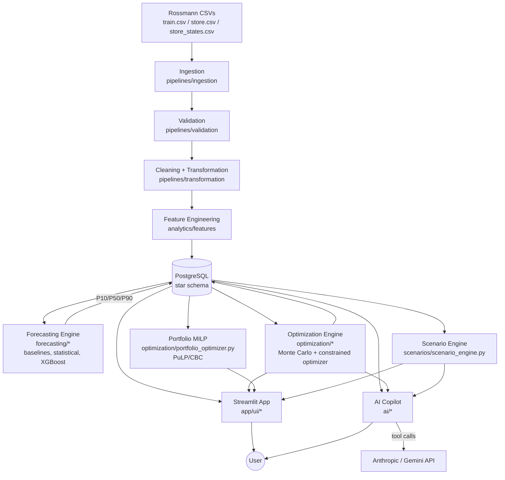

# SupplySense — Intelligent Demand Forecasting & Inventory Decision Engine

**Live demo:** [supplysense-project.streamlit.app](https://supplysense-project.streamlit.app/)

SupplySense is an end-to-end retail decision-analytics platform. It doesn't just predict demand — it turns that forecast, together with its uncertainty, into an actual inventory **decision**: what to order, how much safety stock to hold, and what the stockout/cost tradeoffs look like under different business assumptions.

```
Raw Data → Ingestion → Validation → Cleaning → Transformation →
Feature Engineering → PostgreSQL → Forecasting → Optimization →
Simulation → Scenario Analysis → AI Copilot
```

Built on the public **Rossmann Store Sales** dataset (1,115 stores, ~1.02M store-days), with real backtested forecasting, genuine constrained optimization (Monte Carlo simulation + Mixed-Integer Programming, not a heuristic formula), a full interactive Streamlit application, and a grounded, multi-provider AI copilot — all backed by 202 passing automated tests.

---

## Table of Contents

- [What it does](#what-it-does)
- [Architecture](#architecture)
- [Database schema](#database-schema-star-schema)
- [Dataset & documented assumptions](#dataset--documented-assumptions)
- [Data pipeline](#data-pipeline)
- [Forecasting engine](#forecasting-engine)
- [Optimization & decision engine](#optimization--decision-engine)
- [Application](#application)
- [AI Analytics Copilot](#ai-analytics-copilot)
- [Security & deployment](#security--deployment)
- [Testing](#testing)
- [Setup](#setup)
- [Sample workflow](#sample-workflow)
- [Troubleshooting](#troubleshooting)
- [Project structure](#project-structure)
- [Development history](#development-history)

---

## What it does

| Role                      | What they get                                                                                                  |
| ------------------------- | -------------------------------------------------------------------------------------------------------------- |
| Demand planner            | Historical + forecasted demand per store, seasonality, model performance comparison                            |
| Inventory/supply planner  | A recommended order quantity accounting for lead time, safety stock, MOQ, and target service level             |
| Supply chain manager      | Portfolio-wide exception alerts, budget-constrained-store visibility, shared-budget allocation across a region |
| Category/business manager | What-if scenario modeling (demand shifts, promotions, budget cuts) before committing to a decision             |
| Data/ML team              | Real backtested model comparisons, data-quality logs, full pipeline run history                                |

Anyone can also just **ask the AI Copilot** a question in plain language instead of digging through dashboards — it's grounded in the platform's real data and engines, not a generic chatbot.

---

## Architecture



**Tech stack:** Python, Pandas/NumPy, PostgreSQL, scikit-learn, statsmodels, XGBoost, PuLP (CBC solver), Streamlit, Anthropic / Google Gemini APIs, pytest, Docker.

---

## Database schema (star schema)


`dim_product` exists in the schema for architectural completeness but is intentionally unpopulated — see [Dataset & documented assumptions](#dataset--documented-assumptions) for why.

Indexes are placed on the columns the app and AI Copilot actually filter/sort/join on most: `forecasts(store_id)`, `forecasts(store_id, target_date)`, `model_evaluations(store_id, model_name)`, `optimization_results(store_id, stockout_probability)`.

---

## Dataset & documented assumptions

**Rossmann Store Sales** — a public retail dataset covering daily sales for 1,115 drugstores in Germany from 2013-01-01 to 2015-07-31 (~1.02M store-day records), retrieved from public GitHub mirrors of the original Kaggle competition data:

- `train.csv` — daily `Sales`, `Customers`, `Open`, `Promo`, `StateHoliday`, `SchoolHoliday` per store
- `store.csv` — `StoreType`, `Assortment`, `CompetitionDistance`, `Promo2` fields per store
- `store_states.csv` — store → German federal state mapping

This is real sales data, not a synthetic supply-chain dataset, so a few fields required **documented, defensible proxies** rather than fabrication:

| Business concept                                    | Real field used                                                                        | Notes                                                                                                                                                                                                                                |
| --------------------------------------------------- | -------------------------------------------------------------------------------------- | ------------------------------------------------------------------------------------------------------------------------------------------------------------------------------------------------------------------------------------ |
| Category                                            | `StoreType` (a/b/c/d)                                                                  | Rossmann has no SKU-level sales, so category-level demand isn't decomposable. StoreType is a genuine dataset field distinguishing store formats/assortment strategy.                                                                 |
| Sub-category                                        | `Assortment` (basic/extra/extended)                                                    | Real field.                                                                                                                                                                                                                          |
| Region                                              | German federal state (`store_states.csv`)                                              | Real store→state mapping from a public companion dataset.                                                                                                                                                                            |
| Product                                             | _not populated_                                                                        | `dim_product` exists in the schema for future extension, but is intentionally left empty rather than fabricating SKU-level sales that don't exist in the source data. **"Store" is the atomic demand unit** throughout this project. |
| Unit price                                          | Proxy: store's historical avg. revenue-per-customer-transaction (`sales_per_customer`) | Rossmann's `Sales` field is store _revenue_, not a unit count. Since MOQ/order-multiples/capacity are naturally unit-based, revenue is converted to unit-equivalents using this data-grounded proxy.                                 |
| Margin, holding cost rate, stockout cost multiplier | Configurable business parameters (`config/settings.py: BUSINESS_DEFAULTS`)             | Genuine business policy inputs no sales-history dataset would ever contain — never presented as historical fact.                                                                                                                     |
| Suppliers, lead times, starting inventory           | Synthetic, fixed-seed, reproducible (`optimization/seed_operational_data.py`)          | No public retail dataset ships with a supplier master or inventory feed; every real deployment configures these directly. Clearly labeled wherever they appear.                                                                      |

If you plug in your own dataset with real SKU-level sales, real unit prices, or a real supplier feed, replace the corresponding proxy directly — see the inline comments in `optimization/cost_model.py` and `optimization/seed_operational_data.py`.

---

## Data pipeline

`pipelines/ingestion` → `pipelines/validation` → `pipelines/transformation` → `analytics/features` → PostgreSQL, orchestrated by `scripts/run_phase1_pipeline.py`.

**Validation** (`pipelines/validation/validators.py`): every raw and cleaned table runs through dtype coercion checks, null checks against a declared nullable/non-nullable schema, range checks, allowed-value checks, duplicate detection, referential integrity, and statistical outlier detection (z-score) — logged to `data_quality_log`, not just printed, so the app's Data Quality page can query real history.

**Cleaning** (`pipelines/transformation/clean.py`): documented business-rule fixes (e.g. closed stores forced to zero sales), negative-value clipping, and explicit preservation of legitimately-missing values (e.g. `CompetitionDistance` stays `NULL` rather than being imputed when no competitor is on record).

**Feature engineering** (`analytics/features/feature_engineering.py`): lag features (1/7/14/28 days), rolling mean/std (7/14/28-day windows), calendar features, and a demand-segmentation heuristic (stable/seasonal/volatile/intermittent) — all computed causally (no leakage into backtests).

**Real results from a full run:**

- 1,017,209 rows ingested and loaded, 0 dropped
- 92 automated data-quality checks: **90 pass, 2 warn (statistical outliers), 0 fail**
- 844,392 of 1,017,209 store-days are "open" (16.99% closed, mostly Sundays/holidays)
- Average daily sales per open store: **6,955.5** (median 6,369, P10/P90 = 3,762/10,771)
- Demand segmentation: **1,089 stable, 24 seasonal, 2 volatile** stores
- Promo days average **8,228** vs **5,929** non-promo (correlational only — not claimed as causal uplift)

EDA charts (`reports/eda/`): day-of-week/monthly seasonality, sample store time series, demand-segment distribution, sales histogram.

---

## Forecasting engine

**Methodology:** every model is evaluated with **rolling-origin ("walk-forward") time-series cross-validation** — never a random train/test split, which would leak future information into training. 3 folds, each evaluating a 42-day horizon (matching Rossmann's original 6-week holdout convention). Full benchmarking (baselines + statistical + ML) ran on a **stratified 22-store sample** spanning every demand-segment × store-type combination — fitting per-store SARIMA/Holt-Winters across all 1,115 stores isn't a sensible use of compute for a periodic batch job.

**Real benchmark results** (`reports/forecasting/model_comparison_summary.csv`):

| Model               | Avg MAE | Avg RMSE | Avg MAPE | **Avg WMAPE** | Avg Bias |
| ------------------- | ------- | -------- | -------- | ------------- | -------- |
| **XGBoost**         | 756.4   | 1081.0   | 10.25%   | **9.90%**     | -0.45%   |
| Random Forest       | 1007.7  | 1503.8   | 13.65%   | 12.82%        | -0.53%   |
| SARIMA              | 1512.3  | 1922.4   | 19.53%   | 17.66%        | -0.42%   |
| Holt-Winters        | 1756.8  | 2215.9   | 22.78%   | 20.48%        | -1.63%   |
| Seasonal Naive      | 1858.6  | 2421.2   | 23.27%   | 22.02%        | -0.36%   |
| Naive               | 2115.0  | 2625.4   | 30.94%   | 24.75%        | 2.70%    |
| Moving Average (7d) | 2181.3  | 2698.2   | 30.76%   | 25.66%        | -0.36%   |

**XGBoost won for all 22 of 22 sampled stores** — a clean, decisive result, so it was selected as the production model.

**Production pipeline:**

1. 17 engineered features per store-day (4 lags, 5 rolling windows, calendar, promo/holiday flags, days-since-competition, store type/assortment codes)
2. A single global XGBoost regressor (300 trees, depth 6) trained on all 985,989 valid feature rows across all 1,115 stores at once — not 1,115 separate models
3. Recursive 42-day-ahead forecasting per store, rebuilding lag/rolling features from the model's own prior-day forecasts
4. Probabilistic P10/P50/P90 bands from empirical residual quantiles, **grouped by demand segment** so volatile stores get visibly wider bands than stable ones (real computed offsets: stable ±(−926.9, +758.0), seasonal ±(−881.8, +1402.1), volatile ±(−580.1, +383.8))

**Full-scale results:** 46,830 forecast rows (1,115 stores × 42 days), 0 probabilistic-band ordering violations, 0 negative forecasts. The model correctly learned each store's weekly closure pattern (e.g. Store 1's Sunday forecasts land near-zero).

**Compute note:** this environment has a single CPU core. XGBoost's histogram training scales fine (full fit in ~20s), but scikit-learn's RandomForest doesn't parallelize usefully at full data volume on one core — so Random Forest in the _benchmark_ trains on an 80,000-row subsample with a shallower forest. This doesn't affect the production model (XGBoost, trained on full data) or change which model won.

```bash
python -m scripts.run_phase2_benchmark                 # backtest all model families
python -m scripts.run_phase2_forecast --prepare         # train production model once
python -m scripts.run_phase2_forecast --batch-start 0 --batch-end 1115 --truncate  # generate forecasts
```

---

## Optimization & decision engine

This is SupplySense's core differentiator: **not** `order_qty = forecast * safety_factor`, but a genuine constrained-optimization + Monte Carlo simulation pipeline.

### Monte Carlo simulation (`simulation/monte_carlo.py`)

For a store's lead-time-plus-review-period horizon, each day's demand is sampled from a Normal distribution fit to that day's P10/P50/P90 band, summed across the horizon, repeated 5,000 times. For every candidate order quantity this produces real simulated stockout probability, service level, expected holding cost, expected stockout cost, and expected total cost.

Example (Store 710, real output, abbreviated):

| Order Qty | Stockout Risk | Expected Cost                         |
| --------- | ------------- | ------------------------------------- |
| 0         | 100.0%        | €31,398                               |
| 1,500     | 100.0%        | €27,340                               |
| 2,850     | 73.6%         | €24,040 _(pure cost minimum)_         |
| 3,340     | 4.7%          | €26,158 _(chosen — meets 95% target)_ |
| 3,800     | 0.02%         | €29,708                               |

This U-shaped curve is the classic newsvendor tradeoff: the cost-minimizing quantity (2,850) actually accepts high stockout risk because procurement cost dominates the objective — which is exactly why the optimizer treats the target service level as a real constraint rather than pure cost-minimization (see [Testing](#testing) for the bug this caught).

### Per-store constrained optimizer (`optimization/inventory_optimizer.py`)

Selection logic: among all MOQ/budget/capacity-feasible candidates, **prefer the cheapest one that also meets the target service level**; only fall back to pure cost-minimization if no feasible candidate can reach it (explicitly flagged via `service_level_achievable_under_constraints`, so the business always sees when a target isn't achievable rather than the optimizer silently picking a cheaper, riskier quantity). Every recommendation returns explicit **drivers**: demand change %, inventory status, lead time, budget/capacity status, achieved risk.

### Portfolio-level allocation (`optimization/portfolio_optimizer.py`)

A genuine Mixed-Integer Program (PuLP, CBC solver) for the realistic case where budget/capacity is shared across many stores. Formulated as multiple-choice knapsack: each store offers candidate quantities from its own Monte Carlo cost curve; the solver picks exactly one per store to minimize total portfolio cost subject to a shared budget/capacity constraint. Real example (region with 15 stores, budget capped at 60% of unconstrained need): solved to **Optimal**, **100% budget utilization**, with genuine cost-minimizing tradeoffs across stores (some received zero allocation because their marginal cost-per-euro was worse than others') — not a greedy or proportional split.

### Scenario / what-if engine (`scenarios/scenario_engine.py`)

Re-runs the _same_ optimizer with modified assumptions rather than applying a multiplier to the baseline output. Seven preset scenarios (demand ±20%/−15%, lead time 7→14 days, budget −15%/−20%, capacity +25%, a 2-week +30% promotion) plus arbitrary custom scenarios. Real example (Store 710, +20% demand): recommended order rose **33.5%** while service level held at ~95%.

```bash
python -m scripts.run_phase3_pipeline
```

Seeds suppliers/inventory, computes baseline recommendations for a stratified 120-store sample, runs a portfolio allocation example, and runs all preset scenarios for 8 example stores.

---

## Application

A 7-page Streamlit app (`app/ui/`), connected live to the real database and engines — no mock data anywhere.

| Page                          | What it does                                                                                                                                                    |
| ----------------------------- | --------------------------------------------------------------------------------------------------------------------------------------------------------------- |
| **Home (Overview)**           | Portfolio-wide KPIs, exception alerts (high-stockout-risk / budget-constrained stores), store directory                                                         |
| **Forecast Explorer**         | Historical demand + P10/P50/P90 forecast chart per store, seasonality, per-store model performance                                                              |
| **Inventory Recommendations** | Live-computed recommendation via the real Monte Carlo optimizer, adjustable service level/budget/capacity, full cost breakdown, plain-language decision drivers |
| **Optimization**              | Configure global assumptions; run the real portfolio MILP across a region's stores                                                                              |
| **Scenario Simulator**        | Preset or custom what-if scenarios, baseline-vs-scenario comparison with deltas                                                                                 |
| **Model Performance**         | Full benchmark comparison, per-store winning-model breakdown, raw backtest table                                                                                |
| **Data Quality**              | Latest pipeline run status, pass/warn/fail breakdown, full validation log, run history                                                                          |
| **AI Copilot**                | Natural-language interface — see below                                                                                                                          |

Every page was smoke-tested by direct script execution (catching real Python exceptions, not just checking the server boots).

---

## AI Analytics Copilot

A grounded tool-calling copilot — explicitly **not** a generic chatbot. The system prompt forbids citing any number not returned by a tool call in the same conversation. **Supports either Anthropic (Claude) or Google Gemini** as the backing LLM, auto-detected from whichever API key is configured; both providers share identical tool definitions, dispatch logic, and system prompt.

**Choosing a provider:** set `ANTHROPIC_API_KEY` or `GEMINI_API_KEY` (or both — Anthropic wins by default) in `.env`, or force one via `LLM_PROVIDER=gemini`/`anthropic`. Model names configurable via `ANTHROPIC_MODEL`/`GEMINI_MODEL`, defaulting to `claude-sonnet-5`/`gemini-2.5-flash`.

**Tools available:** `get_store_forecast`, `get_store_history` (real data), `get_store_recommendation` (live optimizer), `run_what_if_scenario` (live scenario engine), `get_model_performance_summary`, `get_stockout_risk_ranking`, `get_data_quality_summary` (real aggregates), `run_sql_query` (read-only SQL for anything else).

**Safeguards (`ai/sql_safety.py`, `ai/sql_executor.py`):**

- Single-statement only (rejects `; DROP TABLE ...` injection)
- SELECT/WITH-only — every DML/DDL/DCL keyword explicitly blocked
- Table allow-list (only the platform's own analytical tables)
- CTE-aware (distinguishes a query's own `WITH x AS (...)` aliases from real external tables, so legitimate CTEs aren't false-positived)
- Dangerous function-call blacklist (`pg_sleep`, `set_config`, `dblink`, etc.)
- Auto-capped row LIMIT (max 500/query); all DB errors caught and returned cleanly, never a raw stack trace
- Backed by a real database-level read-only role (`database/create_readonly_role.sql`) for defense-in-depth beneath the application-level checks

**Example real interaction** (requires your own API key to run live):

> **Q: "Why was XGBoost selected as the forecasting model?"**
> → calls `get_model_performance_summary` → real result: XGBoost avg WMAPE 9.90% vs Random Forest 12.82%, SARIMA 17.66%, Holt-Winters 20.48% → copilot answers citing these exact figures.

**Provider implementation:** Anthropic and Gemini use different message/tool-call formats (`messages.create(tools=...)` with `tool_use`/`tool_result` blocks vs. `generate_content(config=GenerateContentConfig(tools=...))` with `function_call`/`function_response` parts), so `ai/copilot.py` has one loop per provider (`_ask_anthropic`, `_ask_gemini`) behind a single `ask_copilot()` entry point — both call the same `_dispatch_tool_call()` and share `TOOL_DEFINITIONS` unmodified, since Gemini's `FunctionDeclaration.parameters` accepts the same JSON-schema shape Anthropic's `input_schema` uses. Verified against the real `google-genai` SDK, not just mocked tests.

---

## Security & deployment

### Read-only database role

`database/create_readonly_role.sql` provisions a `supplysense_readonly` role with `SELECT`-only grants (including future tables, via `ALTER DEFAULT PRIVILEGES`) — defense-in-depth beneath the AI Copilot's application-level SQL checks. Verified live: the role queries `fact_sales` successfully but `DELETE`/`DROP TABLE` both fail with `permission denied`. In production, point the copilot's DB connection at this role via its own credentials rather than the main application user.

Run it via:

```bash
python -m scripts.create_readonly_role
```

This reuses your app's already-working DB connection instead of a separate `psql` session (avoids credential-mismatch issues). Requires the connecting user to be a superuser or have `CREATEROLE` — works automatically on Docker's Postgres image, or grant it manually on a native install (`ALTER USER supplysense CREATEROLE;`, run as the `postgres` superuser). The script's `GRANT CONNECT` statement resolves the database name dynamically via `current_database()`, so it works regardless of what your database is actually named (local `supplysense`, a managed provider's default like Neon's `neondb`, etc.).

### Docker

`docker-compose.yml` defines three services (`postgres`, `pipeline`, `app`), the last exposing Streamlit on port 8501. `.dockerignore` keeps the build context small.

**Honesty note:** the sandbox this project was built in doesn't have Docker available, so `Dockerfile`/`docker-compose.yml` were reviewed carefully by hand but not build-tested end-to-end — everything else (all application code, the database schema, all tests) has been executed and verified for real.

### Deploying to Streamlit Community Cloud

Streamlit Cloud doesn't host Postgres, so this uses a managed provider (e.g. [Neon](https://neon.tech), free tier) plus Streamlit Cloud for the app. Two things make this work with zero environment-specific code branches:

- **`config/settings.py` bridges Streamlit's `st.secrets` into `os.environ`** at import time (silent no-op outside a Streamlit session, so local scripts/tests are unaffected). The same `Settings` class works whether config comes from `.env`, Docker env vars, or Streamlit Cloud's Secrets panel.
- **`DB_SSLMODE`** (unset by default) lets `database_url` append `?sslmode=require` — most managed Postgres providers mandate SSL; local/Docker Postgres typically doesn't need it.

**Steps:**

1. Provision a Postgres database on Neon (or similar); note host/port/db/user/password.
2. Locally, point `.env` at that hosted DB (set `DB_SSLMODE=require`) and run `bash scripts/run_all_pipelines.sh` once to populate it.
3. Push this repo to GitHub.
4. On [share.streamlit.io](https://share.streamlit.io): New app → point at the repo, main file `app/ui/Home.py`, Python 3.12.
5. In **Settings → Secrets**, set `DB_HOST`, `DB_PORT`, `DB_NAME`, `DB_USER`, `DB_PASSWORD`, `DB_SSLMODE=require`, and one of `ANTHROPIC_API_KEY`/`GEMINI_API_KEY`.
6. Deploy. The app only ever _reads_ at runtime — all data generation happens beforehand in step 2.

The live deployment: **[supplysense-project.streamlit.app](https://supplysense-project.streamlit.app/)**

---

## Testing

**202 tests passing, 1 correctly skipped (203 total)** across the full stack:

| Area                       | Coverage                                                                                                                                                              |
| -------------------------- | --------------------------------------------------------------------------------------------------------------------------------------------------------------------- |
| Data validation & cleaning | Null/range/allowed-value/duplicate/referential/anomaly checks; documented business-rule fixes                                                                         |
| Star-schema transformation | Date-range completeness, region joins, dtype correctness                                                                                                              |
| Feature engineering        | Lag/rolling correctness with explicit no-leakage checks, demand segmentation                                                                                          |
| Forecasting                | Metrics correctness (incl. edge cases), rolling-origin fold generation (no leakage), probabilistic band construction, model selection logic                           |
| Optimization               | Cost model math, Monte Carlo correctness (monotonicity, reproducibility), MOQ/budget/capacity constraint enforcement, portfolio MILP correctness                      |
| Application                | Data-loader shape/sort-order correctness, all 7 pages smoke-tested                                                                                                    |
| AI Copilot                 | SQL injection/DDL/DML rejection, CTE handling, dangerous function blacklist, grounded tool functions, full tool-calling loop mocked for **both** Anthropic and Gemini |
| Security                   | Read-only role enforcement verified against a live database (real permission-denied checks, not mocked)                                                               |
| Deployment config          | `DB_SSLMODE` URL construction                                                                                                                                         |
| End-to-end                 | A full user-journey test spanning Overview → forecast → recommendation → scenario → portfolio → AI copilot tool layer, verifying every layer reads consistent data    |

```bash
pytest
# 202 passed, 1 skipped
```

Three real bugs were caught by this test suite during development (not just after the fact) — see [Development History](#development-history) for details on each.

---

## Setup

```bash
# 1. Clone
git clone https://github.com/Lakshay1905/SupplySense.git
cd SupplySense

# 2. PostgreSQL (native or Docker)
docker-compose up -d postgres
# -- or natively: create a 'supplysense' DB + user

# 3. Python environment
python -m venv venv && source venv/bin/activate
pip install -r requirements.txt

# 4. Configure
cp .env.example .env
# Edit .env: DB credentials, and ANTHROPIC_API_KEY / GEMINI_API_KEY if you want the AI Copilot

# 5. Get the data
bash scripts/download_data.sh

# 6. Run everything (data foundation, forecasting, optimization) + tests
bash scripts/run_all_pipelines.sh

# 7. Launch the app
streamlit run app/ui/Home.py
```

`scripts/run_all_pipelines.sh` runs the complete sequence (schema init → data pipeline → forecast benchmark → full-scale forecasting in 8 batches → optimization pipeline → test suite) in one command. Total runtime is roughly 10-20 minutes, dominated by generating 42-day forecasts for all 1,115 stores.

**Optional — read-only DB role for the AI Copilot (production hardening):**

```bash
python -m scripts.create_readonly_role
```

---

## Sample workflow

1. Open the app → **Home** shows portfolio-wide KPIs and exception alerts.
2. Go to **Forecast Explorer**, pick a store → see historical demand, seasonality, and P10/P50/P90 forecast.
3. Go to **Inventory Recommendations** → see the live-computed recommended order quantity, cost breakdown, and decision drivers.
4. Go to **Scenario Simulator** → apply "Demand +20%" → compare to baseline side-by-side.
5. Go to **Optimization** → select a region → run the portfolio allocator to split a shared budget across stores.
6. Go to **AI Copilot** → ask _"Why did store 710's recommended order increase?"_ → the copilot calls the same live engines and cites the real decision drivers back.

---

## Troubleshooting

- **`psql: error: connection to server on socket ... failed`**: Postgres isn't reachable via the default local socket — usually because it's running in Docker. Connect over TCP instead: `psql -h localhost -p 5432 -U supplysense -d supplysense`.
- **`psql: FATAL: password authentication failed`** even with the right password: don't fight `psql` credentials manually — use `python -m scripts.create_readonly_role` instead, which reuses the same DB connection your already-working app/tests use from `.env`.
- **`permission denied to create role`**: your DB user lacks `CREATEROLE`. Works automatically on Docker's Postgres image; on a native install, grant it manually (`ALTER USER supplysense CREATEROLE;`, run as the `postgres` superuser).
- **`186 passed, 5 skipped` instead of `202 passed, 1 skipped`**: the 4 extra skips are the read-only-role tests auto-skipping because you haven't run `create_readonly_role` yet — expected, not a bug.
- **AI Copilot page says no API key configured**: set `ANTHROPIC_API_KEY` or `GEMINI_API_KEY` in `.env` (or in Streamlit Cloud's Secrets panel if deployed).
- **Hosted Postgres (Neon/Supabase/RDS) connection fails**: set `DB_SSLMODE=require` in `.env`/secrets.

---

## Project structure

```
SupplySense/
├── config/                  # settings.py (env + Streamlit secrets bridge), logging_config.py
├── data/
│   ├── raw/                 # downloaded CSVs (not committed)
│   └── schemas/             # declarative column schemas used by validation
├── database/
│   ├── schema.sql           # full star-schema DDL
│   ├── connection.py        # SQLAlchemy engine, COPY-based bulk loader
│   ├── init_db.py           # create/reset schema
│   └── create_readonly_role.sql
├── pipelines/
│   ├── ingestion/           # raw CSV -> DataFrame
│   ├── validation/          # schema/range/null/duplicate/referential/anomaly checks
│   └── transformation/      # cleaning + star-schema construction
├── analytics/
│   ├── features/            # lag/rolling/calendar features, demand segmentation
│   ├── metrics/             # data-quality aggregation
│   └── eda/                 # EDA report + charts
├── forecasting/
│   ├── baselines/ statistical/ ml/ evaluation/
│   └── probabilistic.py
├── optimization/            # cost model, Monte Carlo integration, per-store + portfolio optimizers
├── simulation/               # Monte Carlo engine
├── scenarios/                # what-if scenario engine
├── ai/                       # copilot orchestration, tool functions, SQL safety layer
├── app/
│   ├── ui/                   # Streamlit pages
│   └── components/           # shared data loaders
├── scripts/                  # pipeline orchestrators + one-command setup
├── tests/                    # 200+ pytest tests (unit + live-DB integration)
├── Dockerfile / docker-compose.yml
└── requirements.txt
```

---

## Development history

SupplySense was built in five phases. This section is a condensed changelog; all methodology, results, and usage details live in the sections above.

**Phase 1 — Data Foundation:** dataset selection, ingestion, validation, cleaning, star-schema transformation, feature engineering, EDA. Caught and fixed a real bug where closed-store sales weren't being zeroed (planted-bug-style test that turned out to matter). 47 tests.

**Phase 2 — Forecasting & Predictive Analytics:** baseline/statistical/ML model benchmarking with rolling-origin cross-validation, XGBoost selected as the production model, probabilistic (P10/P50/P90) forecasting, full-scale forecast generation for all 1,115 stores. +41 tests (88 total).

**Phase 3 — Optimization, Simulation & Decision Engine:** Monte Carlo simulation, per-store constrained optimizer, portfolio MILP (PuLP/CBC), scenario engine. Caught and fixed a real bug where the optimizer was silently minimizing pure cost and could badly miss the target service level (73.6% stockout risk against a 95% target) — fixed with service-level-aware candidate selection. +43 tests (131 total, 130 passing).

**Phase 4 — Application & AI Copilot:** 7-page Streamlit app, grounded tool-calling AI copilot with SQL safety layer. Gemini support added as a second provider alongside Anthropic (auto-detected, shared tool schema, verified against the real `google-genai` SDK). +54 initial tests, +9 net more for the Gemini addition.

**Phase 5 — Finalization & Deployment:** end-to-end journey testing, read-only DB role for defense-in-depth, database indexes, `pyflakes` cleanup (12 unused imports + 1 dead variable removed), Docker Compose, Streamlit Cloud deployment support (secrets bridge, `DB_SSLMODE`). Caught and fixed a real bug where an earlier edit had silently corrupted `database/schema.sql` (deleted the `optimization_results` table's opening line) — only surfaced by a genuine clean-rebuild test, not the existing suite, which is why a full from-scratch rebuild is part of this phase's verification. Also fixed a portability bug in the read-only-role script (hardcoded database name broke on managed providers like Neon whose default database isn't named `supplysense`) — now resolved dynamically via `current_database()`.

**Final state:** 202 passing tests, 1 correctly-skipped edge case, deployed live at [supplysense-project.streamlit.app](https://supplysense-project.streamlit.app/).
